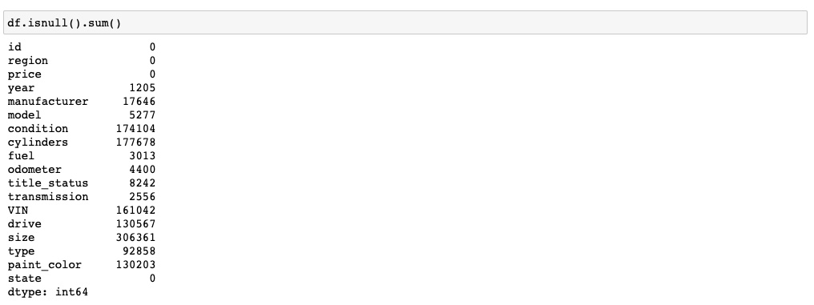

# What-Drives-the-Price-of-a-Car?
This python application will explore a dataset containing information on 3 millions used cars in order to determine which factors make a car more or less expensive. The current CRISP-DM Process Model for Data Mining (see figure 1) will be followed.

<h2>Business Understanding</h2>
The Business task is to identify which factors make a car more or less expensive by designing a python application in jupyter notebook. This application will allow not only dealer tagging a price for a particular car that will be on the market, but also potential buyer to negociate a fair price for any particular car she/he/they is/are interested in.

<h2>Data Understanding</h2>
The dataset given is in .csv format.It consists of 18 columns and 426880 rows as shown below. The target columns is "price" which is numerical. there are only two more columns numerical: "odometer" and "year", i.e., the rest of the columns are categorical. Consequently, most of the dataset provided is imbalanced.

As a part of this step, it was also checked if there were "NaN" values, or the presence of duplicates as shown below:

