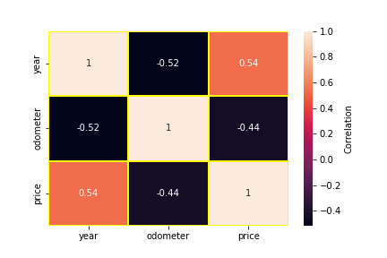
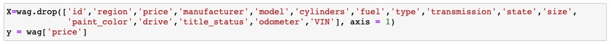
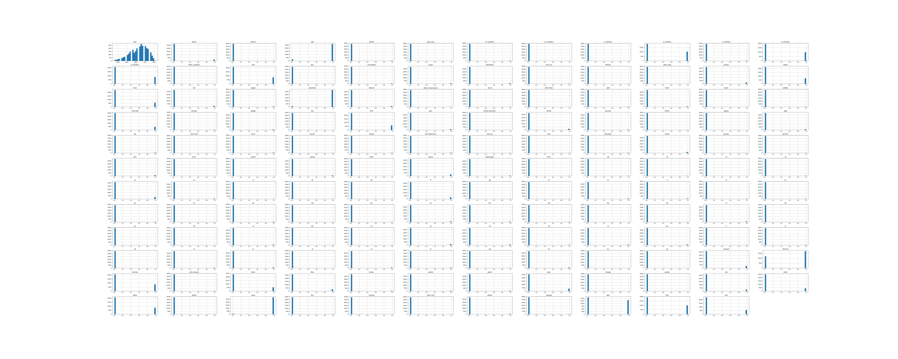
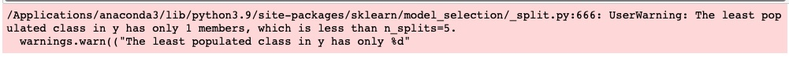
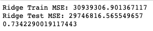
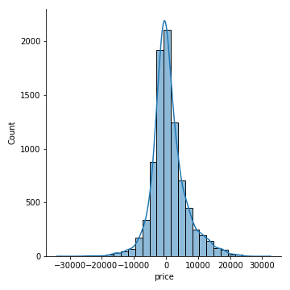

<h1>What Drives the Price of a Car?</h1>
This python application will explore a dataset containing information on 3 millions used cars in order to determine which factors make a car more or less expensive. The current CRISP-DM Process Model for Data Mining (see Figure 1) will be followed.

 
 

<h4 align="center"> Figure 1</h4>

<h2>Business Understanding</h2>
The Business task is to identify which factors make a car more or less expensive by using python & its libraries in jupyter notebook. This application will allow not only dealer tagging a price for a particular car that will be on the market, but also potential buyer to negociate a fair price for any particular car she/he/they is/are interested in.

<h2>Data Understanding</h2>
The dataset (vehicles.csv) given is in .csv format.It consists of 18 columns and 426880 rows as shown below (see Figure 2). The target columns is "price" which is numerical. there are only two more columns numerical: "odometer" and "year", i.e., the rest of the columns are categorical (ordinal and nominal). Consequently, most of the dataset provided will be imbalanced before entering the modeling phase, suggesting it will not be easy at some extend, specially considering the limitation regarding the cross-validation techniques that can be employed, and also the regression models options that can work in this particular case. All the columns, but "region", "price", and "state" contain a bunch of "NaN" values. Duplicates were not observed. It is thought that in order to provide  more insight into the aforementioned dataset, a data preparation, i.e, data cleaning process needs to be done first.

 
 

<h4 align="center"> Figure 2</h4>

<h2>Data Preparation</h2>
The first step was to drop the null values (see Figure 3), and also make sure that there was not duplicates present in the dataset as well. As it is observed in Figure 4, all the columns now have same number of rows with no null values.

 

<h4 align="center"> Figure 3</h4>

 

<h4 align="center"> Figure 4</h4>

 

Columns: "fuel", "cylinders", "type", and "transmission" have a feature with the same name: "other", so it was decided to replace it wiht different name to avoid potential problems in the foregoing analysis as indicated by Figure 5:

 

<h4 align="center"> Figure 5</h4>

 

Although the data preparation process is not totally completed, more insight into the dataset can be gained by doing the histograms for all categorical columns as shown on Figures 6, 7, 8, 9. The first observation is that there are two categorical data: ordinal and nominal. The second observation is that the categorical columns: "fuel", "manufacturer", "Condition", "size", "type", "drive", and "paint color" may be biased or driven by one predominant feature as indicated by their distribution dramatically skewed to the left. For instance, the presence of feature "gas" in the column 'fuel" is overwhelming, which is logical since most of cars are fueled by gas.

 

<h4 align="center"> Figure 6</h4>

 

<h4 align="center"> Figure 7</h4>

 

<h4 align="center"> Figure 8</h4>

 

<h4 align="center"> Figure 9</h4>

<h3>Treatment of Outliers in Numerical Columns: "price", "odometer", and "year"</h3>
The presence of outliers in the numerical columns: 'price", "odometer", and "year" (see Figures 10, 12 and 12) indicated by the respective boxplot demands a careful and efective treatment in order to have to continue to the modeling phase. The histograms of the aforementioned columns have been also added for completeness.

 
 

<h4 align="center"> Figure 10</h4>

 
 

<h4 align="center"> Figure 11</h4>

 
 

<h4 align="center"> Figure 12</h4>

Two passes were applied to the aforementioned columns in order to remove the outliers. Before applying these two passes, values equal to 0 and 1 were removed from the column "price". The first pass consisted on applying the well known Inter quartile range (IQR) method, and the second passes consisted on appyling the DBSCAN ("Density-Based Spatial Clustering of Applications with Noise") method. Figure 13, 14, and 15 shows the final results after applying those two methods to remove the outliers. As it can be observed, the two passes were very effective, i.e., removing the majority of the outliers if any left. as an additional comments, the target column "price" shown a distribution skewed to the right, i.e, its logarithm version was used during the regression modeling by using the TransformedTargetRegressor tool.

 
 

<h4 align="center"> Figure 13</h4>

 
 

<h4 align="center"> Figure 14</h4>

 
 

<h4 align="center"> Figure 15</h4>

Table 1 shows the final statistics of the target column "price":

 

<h4 align="center"> Figure 16</h4>

Once a effective cleaning work has been completed removing most or all of the outliers in the target column "price", boxplot "price" vs. the rest of the columns can be built as follows:

 

<h4 align="center"> Figure 17</h4>

<h4>Observation:</h4>As expected, the most expensive used cars are the ones with four wheels traction.

 

<h4 align="center"> Figure 18</h4>

<h4>Observation:</h4>It is clear an upward trend, i.e. increases in both the median and the mean (white circular dot) of the price as year increases. Therefore, a really nice positive correlation between these two variables are expected.

 
 

<h4 align="center"> Figure 19</h4>

<h4>Observation:</h4> The most expensive cars are the ones fueled by diesel,and the cheaper are the ones fueled by hybrid.

 
 

<h4 align="center"> Figure 20</h4>

<h4>Observation:</h4> The most expensive cars are the ones that look like new as expected,and the cheaper are the ones looking fair.

 
 

 <h4 align="center"> Figure 21</h4>

<h4>Observation:</h4> The most expensive cars are the full size as expected,and the cheaper are the compact, which makes sense.

 
 

<h4 align="center"> Figure 22</h4>

<h4>Observation:</h4> The cars with title status as "lien" are slightly the most expensive, the cheaper are the ones with title status listed as "missing" as must be expected.

 
 

<h4 align="center"> Figure 23</h4>

<h4>Observation:</h4> Really surprised that the cars with the most cylinders are not the most expensive, that label belongs to the one with 10 cylinders. Likewise, the cheapers are not the ones with 4 cylinders, the ones with 5 cylinders are.

 
 

<h4 align="center"> Figure 24</h4>

<h4>Observation:</h4> There is not observable pattern in this category, trucks are even more expensive than the bus and convertibles as many may have not thought.  A battle between the sedan and the hatchback cars for the cheapers cars is observed.

 
 

<h4 align="center"> Figure 25</h4>

<h4>Observation:</h4>  A bit surprised that the most expensive used cars by a relative large margin are the ones manufactured by Tesla. Th cheapers are the ones manufactured by satum.

 
 

<h4 align="center"> Figure 26</h4>

<h4>Observation:</h4> Certainly, the place to look for  cheapers used cars is Washington DC, and the ones not to go for that are: Arkansas,Tennessee, and South Dakota , in that orders.

 
 

<h4 align="center"> Figure 26</h4>

<h4>Observation:</h4> it seems that there is not much difference in price among the different transmission.

<h4>Treatment of Categorical Features</h4>

<h3>Nominal Features</h3>
Nominal features are categorical features that have no numerical importance. Order does not matter. Most of the columns were found to fall in this category as follows: "fuel", "cylinders","type","transmission", "manufacturer", "state", "size", "paint_color", "title_status", "model", and "drive". The Pandas getdummies function to creates dummy variables was used to treat them. A dummy variable is a numerical variable that encodes categorical information, having two possible values: 0 or 1. It is important to highlight that the columns: "model" and "region" were not encoded, i.e., not used for the rest of the analysis, since they contain 4375 and 389 features respectively. Otherwise, it will takes geological ages to do any modelling in my tiny laptop. Those encoded features were added to the existing dataset using the panda function contact as shown  on Figure 28:

 
 

<h4 align="center"> Figure 28</h4>

<h3>Ordinal Features</h3>
The categorical feature "condition" is ordered values, so a numeric value representing the scale can be used. In this case, a scale of 0 - 5 can associate the categories with an order in a list from least to greatest. Creating an OrdinalEncoder with these categories will transform the condition feature mapping each category as:

'salvage': 0
'fair: 1
'good': 2
'excellent': 3
'like new': 4
'new':5

The make_column_transformer  function is used to apply the transformer to the aforemetioned features as follows:

 
 

<h4 align="center"> Figure 29</h4>

<h3>Correlation among the original numerical columns: "price", "year", and "odometer"</h3>
A cross-correlation among the original numerical columns:"price", "year", and "odometer" was carried out. it indicate that there is positive, and correlation greater than 0.50 between the columns: "year" and "price". Conversely, a negative correlation was found between the columns: "odometer", and "price" as shown on Heatmap in Figure 30. Consequently, it was decided to drop the column: "odometer".

 
 

<h4 align="center"> Figure 30</h4>

<h3>Splitting the variables</h3>
Splitting the dependent variable from the independent variables and assigning them to y and X respectively was done as follows:

 
 

<h4 align="center"> Figure 31</h4>

 

<h4 align="center"> Figure 32</h4>

As it is observed the columns: "VIN", "id"  were also dropped. The independent dataset is comprised by 144 columns and 29250 rows. Figure 33 shows the histogram for columns comprising X dataset. Please keep in mind that the intention is not being able to see the label, just the bar, etc in the hisogram, because there are too many histogram, so I do appreciate the undertanding.

<h4 align="center">Figure 33</h4>

 

<h2>Modeling</h2>
<h3>Cross-Validation Approach used</h3>
Most of the indepent variables, i.e. columns (after treating the nominal categories) are imbalanced dataset. Thus, not all the cross-validation techniques can be used, if reliables training and validation dataset are desired to be built for modeling purpose. Beside, the leave one out cross-validation which is very exhaustive from the computational point of view, there is only one remaining: Stratified K-Fold Cross-Validation. I really tried to test it, but everytime, I was getting the message shown below:

 
 

<h4 align="center"> Figure 34</h4>

Getting this message is because the dependent variable y (i.e, the target columns: "price") doesn't have sufficient class labels of one of the classes to keep the data splitting ratio equal to test_size. Consequently, I gave up using the StratifiedKFold function. Instead, I did chose to use train_test_split function with all its shortcoming (not keeping same data ratio of target column in samples) when part of the data is imbalanced.
                       
Since the dependent dataset X contains 144 columns, it was decided to give a try to reduce that number by creating a simple pipeline model, and use the permutation_importance function, and the  filter the result to only leave the columns with the importance greater than 0. As a result, only 138 columns satisfied the aforementioned condition. Although not shown here, doing it help to improve the statistics (MSE and score) in the regression models built later on. The resulting names of the 138 columns are shown below:
 
 

<h4 align="center"> Figure 35</h4>

                                                                                        

As mentioned above, the splitting data into training and testing sets was done using the train_test_split function as shown below:

 

<h4 align="center"> Figure 36</h4>

<h3>Regression Models Built</h3>
There only 4 regression models tested during the modeling phase: Ridge regression, SequentialFeature selection with Linear Regression, Lasso Rregression, and Ordinarily Least Squares (OLS).

<h4>Ridge regression model</h4>
The pipeline model is shown in Figure 37. Please note that the TransformedTargetRegressor function is used to apply a non-linear transformation to the target y. This transformation was given as a function and its inverse such as np.log and np.expm1. 
                  
 
 

<h4 align="center"> Figure 37</h4>

The GridSearchCV function was used to optimized the hyper-parameter alpha (see Figure 38), obtaining the following statistical results shown on Figure 39. The differences between the validation test and the predicted by the model are shown  as a histogram plot (Figure 40), explaining why the MSE for both the training and validation sets are quite high. Although, the  R^2 score value of 0.73422 is pretty decent. Regarding the regression coefficient obtained, there were 59 greater than 0, 79 less than 0, and none of them have zero value. The 10 most important coefficients contributing positively to the used car price, and the 10's that contribute negatively are shown as table 2 and 3 respectively. According to the Ridge Model, the most important factor driving positively the price of a used car is its condition, and the one affecting it most negatively is the transmission of the car is not automatic or manual.
                  
 

<h4 align="center"> Figure 38</h4>

                  
 

<h4 align="center"> Figure 39</h4>

 

<h4 align="center"> Figure 40</h4>

 

<h4 align="center"> Table 2</h4>

 

<h4 align="center"> Table 3</h4>

<h4>SequentialFeatureSelection with Linear Regression model</h4>
The pipeline model is shown in Figure 41. Please note that the TransformedTargetRegressor function is used to apply a non-linear transformation to the target y. This transformation was given as a function and its inverse such as np.log and np.expm1. 

 
 

<h4 align="center"> Figure 41</h4>

The GridSearchCV function was also used to optimized the hyper-parameter: n_features_to_select  (see Figure 42). The statistical results are shown on Figure 43. The differences between the validation test and the predicted by the model are shown  as a histogram plot (Figure 44), explaining why the MSE for both the training and validation sets are quite high. Although, the  R^2 score value of 0.73422 is pretty decent. Regarding the regression coefficient obtained, there were 59 greater than 0, 79 less than 0, and none of them have zero value. The 10 most important coefficients contributing positively to the used car price, and the 10's that contribute negatively are shown as table 2 and 3 respectively. According to the Ridge Model, the most important factor driving positively the price of a used car is its condition, and the one affecting it most negatively is the transmission of the car is not automatic or manual.
