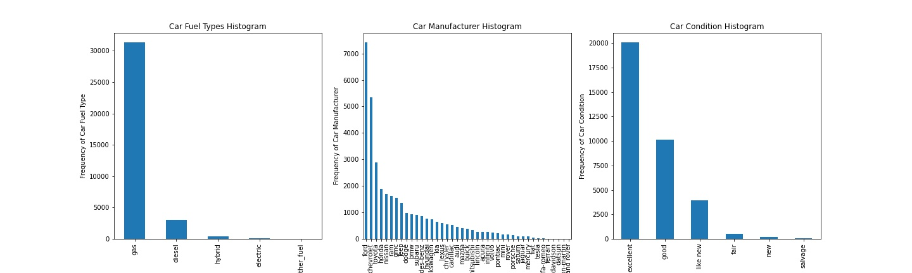
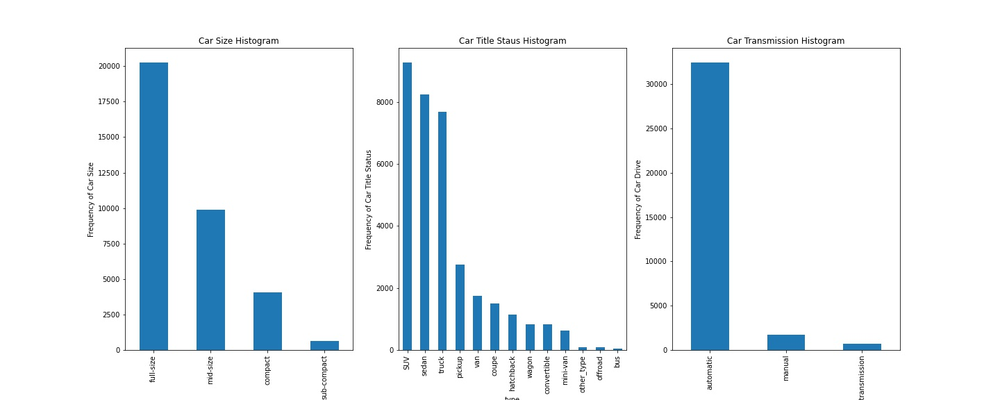
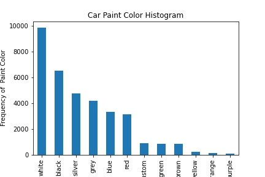

<h1>What Drives the Price of a Car?</h1>
This python application will explore a dataset containing information on 3 millions used cars in order to determine which factors make a car more or less expensive. The current CRISP-DM Process Model for Data Mining (see Figure 1) will be followed.

 
 

<h4 align="center"> Figure 1</h4>

<h2>Business Understanding</h2>
The Business task is to identify which factors make a car more or less expensive by using python & its libraries in jupyter notebook. This application will allow not only dealer tagging a price for a particular car that will be on the market, but also potential buyer to negociate a fair price for any particular car she/he/they is/are interested in.

<h2>Data Understanding</h2>
The dataset (vehicles.csv) given is in .csv format.It consists of 18 columns and 426880 rows as shown below (see Figure 2). The target columns is "price" which is numerical. there are only two more columns numerical: "odometer" and "year", i.e., the rest of the columns are categorical. Consequently, most of the dataset provided is imbalanced, suggesting that the modeling part will not be easy at some extend, specially considering the limitation regarding the cross-validation techniques that can be employed, and also the regression models options that can work in this particular case. All the columns, but "region", "price", and "state" contain a bunch of "NaN" values. Duplicates were not observed. It is thought that in order to provide  more insight into the aforementioned dataset, a data preparation, i.e, data cleaning process needs to be done first.

 
 

<h4 align="center"> Figure 2</h4>

<h2>Data Preparation</h2>
The first step was to drop the null values (see Figure 3), and also make sure that there was not duplicates present in the dataset as well. As it is observed in Figure 4, all the columns now have same number of rows with no null values.

 

<h4 align="center"> Figure 3</h4>

 

<h4 align="center"> Figure 4</h4>

 

Columns: "fuel", "cylinders", "type", and "transmission" have a feature with the same name: "other", so it was decided to replace it wiht different name to avoid potential problems in the foregoing analysis as indicated by Figure 5:

 

<h4 align="center"> Figure 5</h4>

 

Although the data preparation process is not totally completed, more insight into the dataset can be gained by doing the histograms for all categorical data first as shown on Figure 6, Figure 7, Figure 8, and Figure 9. The first observation is that there are two categorical data: ordinal and nominal. The second observation that the categorical columns: "fuel", "manufacturer", "Condition", "size", "type", "drive", and "paint color" may be biased or driven by one predominant feature as indicated by their distribution dramatically skewed to the left.

 

<h4 align="center"> Figure 6</h4>

 

<h4 align="center"> Figure 7</h4>

 

<h4 align="center"> Figure 8</h4>

 

<h4 align="center"> Figure 9</h4>

