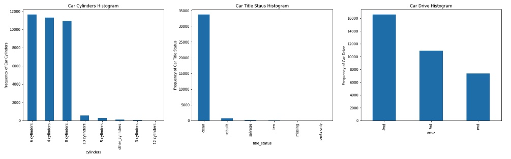
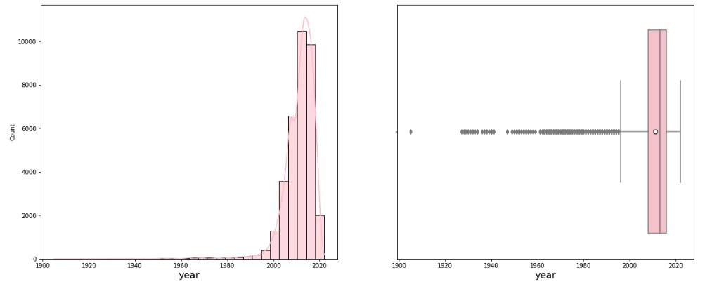
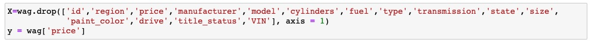
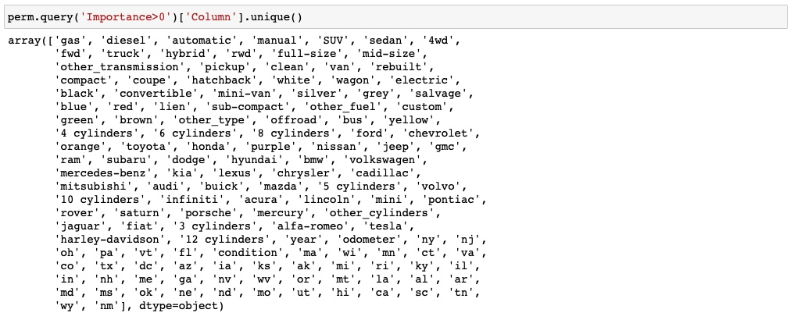
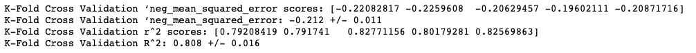
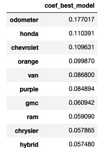
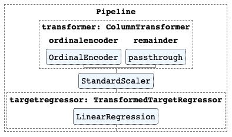

<h1>What Drives the Price of a Car?</h1>
This python application using jupyter notebook explored a dataset containing information on 3 millions used cars in order to determine which factors make a car more or less expensive. 

[Jupiter Notebook used](https://github.com/Leopard-2019/What-Drives-the-Price-of-a-Car/blob/main/notebook/PracticalApplicationAssignment_11_1-Copy1.ipynb)

The current CRISP-DM Process Model for Data Mining (see Figure 1) was followed.

 
 

<h4 align="center"> Figure 1</h4>

<h2>Business Understanding</h2>
The Business task is to identify which factors make a car more or less expensive by using python & its libraries in jupyter notebook. This application will allow not only dealer tagging a price for a particular car that will be on the market, but also potential buyer to negociate a fair price for any particular car she/he/they is/are interested in.

<h2>Data Understanding</h2>
The dataset (vehicles.csv) given is in .csv format.It consisted of 18 columns and 426880 rows as shown below (see Figure 2). The target columns is "price" which is numerical. there were only two more columns numerical: "odometer" and "year", i.e., the rest of the columns were categorical (ordinal and nominal). Consequently, most of the dataset provided will be imbalanced before entering the modeling phase. All the columns, but "region", "price", and "state" contain a bunch of "NaN" values. Duplicates were not observed. It is thought that in order to provide  more insight into the aforementioned dataset, a data preparation, i.e, data cleaning process needs to be done first.

 
 

<h4 align="center"> Figure 2</h4>

<h2>Data Preparation</h2>
The first step was to drop the null values (see Figure 3), and also make sure that there was not duplicates present in the dataset as well. As it is observed in Figure 4, all the columns now have same number of rows with no null values.

 

<h4 align="center"> Figure 3</h4>

 

<h4 align="center"> Figure 4</h4>

 

Columns: "fuel", "cylinders", "type", and "transmission" have a feature with the same name: "other", so it was decided to replace it wiht different name to avoid potential problems in the foregoing analysis as indicated by Figure 5:

 

<h4 align="center"> Figure 5</h4>

 

Although the data preparation process is not totally completed, more insight into the dataset can be gained by doing the histograms for all categorical columns as shown on Figures 6, 7, 8, 9. The first observation is that there are two categorical data: ordinal and nominal. The second observation is that the categorical columns: "fuel", "manufacturer", "Condition", "size", "type", "drive", and "paint color" may be biased or driven by one predominant feature as indicated by their distribution dramatically skewed to the left. For instance, the presence of feature "gas" in the column 'fuel" is overwhelming, which is logical since most of cars are fueled by gas.

 

<h4 align="center"> Figure 6</h4>

 

<h4 align="center"> Figure 7</h4>

 

<h4 align="center"> Figure 8</h4>

 

<h4 align="center"> Figure 9</h4>

<h3>Treatment of Outliers in Numerical Columns: "price", "odometer", and "year"</h3>
The presence of outliers in the numerical columns: 'price", "odometer", and "year" (see Figures 10, 12 and 12) indicated by the respective boxplot demands a careful and efective treatment before moving into the modeling phase. The histograms of the aforementioned columns have been also added for completeness.

 
 

<h4 align="center"> Figure 10</h4>

 
 

<h4 align="center"> Figure 12</h4>

Two passes were applied to the aforementioned columns in order to remove the outliers. Before applying these two passes, values equal to 0 and 1 were removed from the column "price". The first pass consisted on applying the well known Inter quartile range (IQR) method, and the second passes consisted on appyling the DBSCAN ("Density-Based Spatial Clustering of Applications with Noise") method. Figure 13, 14, and 15 shows the final results after applying those two methods to remove the outliers. As it can be observed, the two passes were very effective, i.e., removing the majority of the outliers if any left. As an additional comments, the target column "price" shows a distribution skewed to the left, i.e, its logarithm version was used during the regression modeling by using the TransformedTargetRegressor tool.

 
 

<h4 align="center"> Figure 13</h4>

 
 

<h4 align="center"> Figure 11</h4>

 
 

<h4 align="center"> Figure 14</h4>

 
 

<h4 align="center"> Figure 15</h4>

Table 1 shows the final statistics of the target column "price":

 

<h4 align="center"> Figure 16</h4>

Once an effective cleaning work has been completed, including removing most or all of the outliers. A boxplot "price" vs. the rest of the columns can be built & analyized as follows:

 

<h4 align="center"> Figure 17</h4>

<h4>Observation:</h4>As expected, the most expensive used cars are the ones with four wheels traction.

 

<h4 align="center"> Figure 18</h4>

<h4>Observation:</h4>It is clear an upward trend, i.e. increases in both the median and the mean (white circular dot) of the price as year increases. Therefore, a really nice positive correlation between these two variables are expected.

 
 

<h4 align="center"> Figure 19</h4>

<h4>Observation:</h4> The most expensive cars are the ones fueled by diesel,and the cheaper are the ones fueled by hybrid.

 
 

<h4 align="center"> Figure 20</h4>

<h4>Observation:</h4> The most expensive cars are the ones that look like new as expected,and the cheaper are the ones looking fair.

 
 

 <h4 align="center"> Figure 21</h4>

<h4>Observation:</h4> The most expensive cars are the full size as expected,and the cheaper are the compact, which makes sense.

 
 

<h4 align="center"> Figure 22</h4>

<h4>Observation:</h4> The cars with title status as "lien" are slightly the most expensive, the cheaper are the ones with title status listed as "missing" as must be expected.

 
 

<h4 align="center"> Figure 23</h4>

<h4>Observation:</h4> Really surprised that the cars with the most cylinders are not the most expensive, that label belongs to the one with 10 cylinders. Likewise, the cheapers are not the ones with 4 cylinders, the ones with 5 cylinders are.

 
 

<h4 align="center"> Figure 24</h4>

<h4>Observation:</h4> There is not observable pattern in this category, trucks are even more expensive than the bus and convertibles as many may have not thought.  A battle between the sedan and the hatchback cars for the cheapers cars is observed.

 
 

<h4 align="center"> Figure 25</h4>

<h4>Observation:</h4>  A bit surprised that the most expensive used cars by a relative large margin are the ones manufactured by Tesla. Th cheapers are the ones manufactured by satum.

 
 

<h4 align="center"> Figure 26</h4>

<h4>Observation:</h4> Certainly, the place to look for  cheapers used cars is Washington DC, and the ones not to go for that are: Arkansas,Tennessee, and South Dakota , in that order.

 
 

<h4 align="center"> Figure 27</h4>

<h4>Observation:</h4> it seems that there is not much difference in price among the different transmission types.

<h4>Treatment of Categorical Features</h4>

<h3>Nominal Features</h3>
Nominal features are categorical features that have no numerical importance. Order does not matter. Most of the columns were found to fall in this category as follows: "fuel", "cylinders","type","transmission", "manufacturer", "state", "size", "paint_color", "title_status", "model", and "drive". The Pandas getdummies function to creates dummy variables was used to treat them. A dummy variable is a numerical variable that encodes categorical information, having two possible values: 0 or 1. It is important to highlight that the columns: "model" and "region" were not encoded, i.e., not used for the rest of the analysis, since they contain 4375 and 389 features respectively, i.e, way too may no handle in the modeling phase. Otherwise, it will takes geological ages to do any modelling in the tiny laptop used. Those encoded features were added to the existing dataset using the panda function contact as shown  on Figure 28:

 
 

<h4 align="center"> Figure 28</h4>

<h3>Ordinal Features</h3>
The categorical feature "condition" is ordered values, so a numeric value representing the scale can be used. In this case, a scale of 0 - 5 can associate the categories with an order in a list from least to greatest. Creating an OrdinalEncoder with these categories will transform the condition feature mapping each category as:

'salvage': 0
'fair: 1
'good': 2
'excellent': 3
'like new': 4
'new':5

The make_column_transformer  function is used to apply the transformer to the aforemetioned features as follows:

 
 

<h4 align="center"> Figure 29</h4>

Since, most of the columns are imbalanced values (0 or 1), it was decided to scale the columns: "year", "odometer", and "price" as follow:

 
 

<h4 align="center"> Figure 30</h4>

<h3>Splitting the variables</h3>
Splitting the dependent variable from the independent variables and assigning them to y and X respectively was done as follows:

 
 

<h4 align="center"> Figure 31</h4>

 

<h4 align="center"> Figure 32</h4>

As it is observed the columns: "VIN", "id"  were also dropped. The independent variables dataset is comprised by 145 columns and 29250 rows. Figure 33 shows the histogram for the columns comprising X dataset. Please keep in mind that the intention is not being able to see the label, just the bars, etc in the histogram, because there are too many histogram, so it is appreciated the undertanding.

<h4 align="center">Figure 33</h4>

 

<h2>Modeling</h2>
<h3>Cross-Validation Approach used</h3>
Most of the independent variables, i.e. columns (after treating the nominal categories) are imbalanced data. But, the target variable (column: "price") is continuous, and the final dataset assembled is considered large. Thus,  it was  decided to use Hold-out based cross-validation method. In this technique, the whole dataset is randomly partitioned into a training set and validation set. Using a rule of thumb 70% of the whole dataset was used as a training set and the remaining 30% was used as the validation set. However, it was also used the K-Fold Cross-Validation for completness, in order to also compare among the regression models bult in term of their metrics. In this last technique, a k=5 was chosen, which is recommended for large dataset.          
Since the dependent dataset X contains 145 columns, it was decided to give a try to reduce that number of columns by creating a simple pipeline model, and use the permutation_importance function, and then, filtering the result to only leave the columns with the importance greater than 0. As a result, only 138 columns satisfied the aforementioned condition. It helped to improve the statistics (MSE and R^2 score) in the regression models built later on. The resulting names of the 138 columns are shown below:
 
 

<h4 align="center"> Figure 34</h4>

                                                                                        

As mentioned above, HoldOut Cross-validation, i.e, splitting data into training and validation sets was done using the train_test_split function as shown below:

 

<h4 align="center"> Figure 35</h4>

<h3>Regression Models Built</h3>
There were only 4 regression models tested during the modeling phase: Ridge regression, SequentialFeature selection with Linear Regression, Lasso Regression, and Ordinarily Least Squares (OLS).

<h4>Ridge regression model</h4>
The pipeline model is shown on Figure 36. Please note that the TransformedTargetRegressor function is used to apply a non-linear transformation to the target y. This transformation was given as a function and its inverse such as np.log and np.expm1. 
                  
 

<h4 align="center"> Figure 36</h4>

The GridSearchCV function was used to optimized the hyper-parameter alpha (see Figure 37). the best alpha value estimated was 0.1. The metrics results are  shown on Figure 38. The differences between the validation test and the predicted by the model are shown  as a histogram plot (Figure 39). As mentioned before, the K-fold cross-validation technique was also used to estimate metrics, in this case  "neg_mean_squared_error" and "R^2" were chosen as a score (see Figure 40). Regarding the regression coefficient obtained, there are 72 greater than 0, 64 less than 0, and none of them have zero value. The 10 most important coefficients contributing positively to the used car price, and the 10's that contribute most negatively are shown in tables 2 and 3 respectively. 
                  
 

<h4 align="center"> Figure 37</h4>

 

<h4 align="center"> Figure 38</h4>

 
 

<h4 align="center"> Figure 39</h4>

 

<h4 align="center"> Figure 40</h4>

 

<h4 align="center"> Table 2</h4>

 

<h4 align="center"> Table 3</h4>

<h4>SequentialFeatureSelection with Linear Regression model</h4>
The pipeline model for this regression model is shown on Figure 41.The TransformedTargetRegressor function was also used for same non-linear transformation to the target y.

 

<h4 align="center"> Figure 41</h4>

The GridSearchCV function was used to optimized the hyper-parameter n_features_to_select (see Figure 42). The optimum n_features_to_select value estimated was 10. The metrics results  are shown on Figure 43. The differences between the validation test and the predicted by the model are shown  as a histogram plot (Figure 44). As done in the previous model, the K-fold cross-validation technique was also used to estimate metrics (see Figure 45). The regression coefficients of the 10 features selected are shown on Table 4.

 

<h4 align="center"> Figure 42</h4>

 

<h4 align="center"> Figure 43</h4>

 

<h4 align="center"> Figure 44</h4>

 

<h4 align="center"> Figure 45</h4>

 

<h4 align="center"> Table 4</h4>

<h4>Lasso Regression</h4>
The pipeline model is shown on Figure 46. Please note that the TransformedTargetRegressor function is used to apply a non-linear transformation to the target y. This transformation was given as a function and its inverse such as np.log and np.expm1. 

 

<h4 align="center"> Figure 46</h4>

The GridSearchCV function was used to optimized the hyper-parameter alpha (see Figure 47). the best alpha value estimated was 0.1. The metrics results are  shown on Figure 48. The differences between the validation test and the predicted by the model are shown  as a histogram plot (Figure 49). As done in previous regression model built, the K-fold cross-validation technique was also used to estimate metrics (see Figure 50). The non-zero regression coefficients are shown on Table 5.

 

<h4 align="center"> Figure 47</h4>

 

<h4 align="center"> Figure 48</h4>

 

<h4 align="center"> Figure 49</h4>

 

<h4 align="center"> Figure 50</h4>

 

<h4 align="center"> Table 5</h4>

 

<h4>Ordinarily Least Squares (OLS)</h4>
The pipeline model is shown in Figure 51. Please note that the TransformedTargetRegressor function is again used to apply a non-linear transformation to the target y. This transformation was given as a function and its inverse such as np.log and np.expm1. 

 

<h4 align="center"> Figure 51</h4>

There was not need to use  GridSearchCV function, since there was not hyperparamter to be estimated, i.e. optimized. The metrics results are  shown on Figure 52. The differences between the validation test and the predicted by the model are shown  as a histogram plot (Figure 53). As done in previous regression model built, the K-fold cross-validation technique was also try to be used, but unfortunately,  an error message eror was kept showing up everytime, it was tried to apply this cross-validation technique in this particular regression model (see Figure 54). The non-zero regression coefficients are shown on Table 5. The 10 most important coefficients contributing positively to the used car price are shown as table 6.

 

<h4 align="center"> Figure 52</h4>

 

<h4 align="center"> Figure 53</h4>

 

<h4 align="center"> Figure 54</h4>

 

<h4 align="center"> Table 5</h4>

 

<h2>Evaluation</h2>
The MSE's and R^2 score metrics estimated in the different regression models using the hold-out cross-validation technique are show on Figure 55 and 56. As, it is observed, the lowest MSE and highest R^2 score are basically shared between the Ridge and OLS regression Model, however,  it is thought that the regression coefficients obtained in the Ridge Model look more reasonable, plus the OLS method failed when the F-Fold cross-validation method was intended to be applied as observed on Figure 57 and 58. Consequently, the Ridge regression model was chosen as the best, i.e. recommended to make prediction on the price of the used cars.

 

<h4 align="center"> Figure 55</h4>

 

<h4 align="center"> Figure 56</h4>

 

<h4 align="center"> Figure 57</h4>

 

<h4 align="center"> Figure 58</h4>

 

The variables that have the biggest impact on predicting the price car can be estimated using the permutation_importance function. This one was applied using the validation data from the  hold-out cross-validation, and the Ridge as a regression model. Figure 59 shows the results for the 10 most important variables. In the aforementioned picture, the three most important features were gas,diesel, and automatic in that order.

 

<h4 align="center"> Figure 59</h4>

 

<h2>Deployment</h2>
The code was written in Python, and it is available in a Jupyter Notebook that can be accessed in the link posted at the beginning of this document.

<h2>Main Conclusions & Recomendations</h2>

1. The final dataset, after cleaning, removing outliers,  converting the categoricals data in 0 and 1 values, and dropping the less important columns consists of 136 columns and 429250 rows. The target columns was "price".

2. The best regression model is the Ridge based on the metric estimated using both the hold-out and K-Fold cross-validation methods. An excelente R^2 score (a goodness-of-fit measure for linear regression models) of 0.82 was obtained, i.e., indicating how well this regression model fits the validation dataset.

 3. It is important to highlight that the numerical variables "price", "odometer", and "year" were divided by 10000, 100000, and 1000 respectively, before initiating the regression modeling, since the rest of the columns have values 0 and 1, but the variable "conditon which is ordinal (i.e., integer values from 0 to 5). This step was very important to greatly improved the metrics,etc  of the regression models tested.

 4. The three most important features driving the price of a used car were "gas","diesel", and "automatic" in that order, according to the permutation_importance function using the the hold-out cross-validation method, and Ridge regression model. The 10 most important coefficients contributing positively to the used car price, and the 10's that contribute most negatively are shown in tables 2 and 3 respectively. 

 5. There were only three numerical variables in the initial dataset, the rest were categoricals that were converted to values 0 and 1, but just one ordinal (integer values ranging from 0 to 5).  Therefore, there were way too many variables with values 0 and 1  to be used in the modeling phase, limiting at some extend some options that could have been used to improve the prediction, such as the use of polynomial features with degree greater than 1. It took forever even for degree equal to 2. A possible solution is to drastically limit the number of variables into the regression modeling by using the final permutation_importance results obtained at the end of this study.

 6. It is thought that the number of features could be reduced by applying PCA, and some clustering algorithm, making sure that removing a given feature, the clustering results are not affected.

